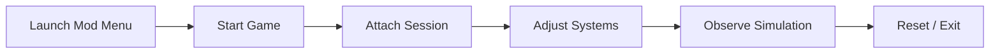

# Mall Simulator Mod Menu

A quiet panel behind the curtain.
A **desktop application** that unfolds the inner rhythms of **Mall Simulator**, giving you hands-on access to simulation systems that usually stay hidden beneath foot traffic and neon signs.

Mall Simulator Mod Menu is built for **offline play, experimentation, and learning**—a place where curiosity can breathe without consequence.

---

## Why a Mod Menu?

Mall simulators are living systems.
Money flows like weather, customers behave like crowds, and time presses forward without mercy.

A mod menu exists to soften that pressure.

This tool was created to:

* Explore economic balance without bankruptcy
* Observe customer behavior in slow motion
* Test layouts, pricing, and staffing decisions safely
* Support accessibility and creative experimentation

It doesn’t replace decision-making.
It simply lets you *listen longer*.

---

## What This Mod Menu Controls

Mall Simulator Mod Menu exposes live simulation parameters through a clean, reversible interface.

### Economic Layer

* Cash balance adjustment
* Rent and maintenance scaling
* Income and expense multipliers

### Time & Simulation Pace

* Time speed control
* Pause and step-through simulation ticks
* Day, week, or season skipping

### Customer Behavior

* Foot traffic density
* Satisfaction and patience values
* Spending likelihood tuning

### Staff & Operations

* Employee stamina locks
* Efficiency modifiers
* Maintenance and breakdown suppression

Every toggle applies instantly and can be undone just as easily.

---

## Design Values

### Explicit Control

Each option maps to a single system—no bundled effects, no hidden automation.

### Runtime Only

No save files are rewritten. Closing the game restores default behavior.

### Calm UX

Flat menus, readable labels, no visual clutter. The menu stays out of the way.

### Respectful Scope

Designed for **personal and offline environments** only.

[!WARNING]
Using mod menus in shared, competitive, or online contexts may violate game rules. Always respect platform and developer policies.

---

## Configuration & Customization

For players who like persistence, the mod menu supports optional configuration files.

Example:

```ini
[economy]
money_multiplier=10.0
rent_scale=0.4

[time]
time_speed=0.3
pause_on_event=true

[customers]
traffic_density=2.0
satisfaction_lock=true

[staff]
efficiency_multiplier=1.5
fatigue_disabled=true
```

Invalid values are ignored safely.

[!NOTE]
Configuration files are optional. The mod menu works fully in manual mode.

---

## Compatibility Matrix

| OS           | Architecture | Status        | Accessibility Note    |
| ------------ | ------------ | ------------- | --------------------- |
| Windows 10   | x64          | Supported     | Keyboard navigation   |
| Windows 11   | x64          | Supported     | Screen reader labels  |
| Linux (Wine) | x64          | Experimental  | Partial focus support |
| macOS        | —            | Not supported | —                     |

---

## Installation & Usage

1. Close Mall Simulator
2. Launch Mall Simulator Mod Menu
3. Start the game normally
4. Attach to the active session
5. Toggle or adjust systems as desired

No administrator rights, background services, or drivers are used.

[!IMPORTANT]
Always close the mod menu before switching to online modes or installing updates.

---

## Example Workflow



This loop encourages reflection instead of reaction.

---

## Frequently Asked Questions

**Does this permanently alter my save?**
No. All changes are memory-only unless saved manually in-game.

**Is automation included?**
No bots, scripts, or auto-management features are provided.

**Can it help with mall layout planning?**
Yes. Time control and economic stability make pattern observation much clearer.

**Will game updates affect it?**
Possibly. Simulation changes may require compatibility updates.

---

## Closing Notes

Mall Simulator Mod Menu does not run the mall for you.
It simply dims the noise, slows the clock, and lets you watch the city breathe.

For players who enjoy understanding systems as living poetry—
this tool offers a quieter way to learn their rhythm.

Explore gently. Adjust thoughtfully.
Let the numbers tell their story.

---
